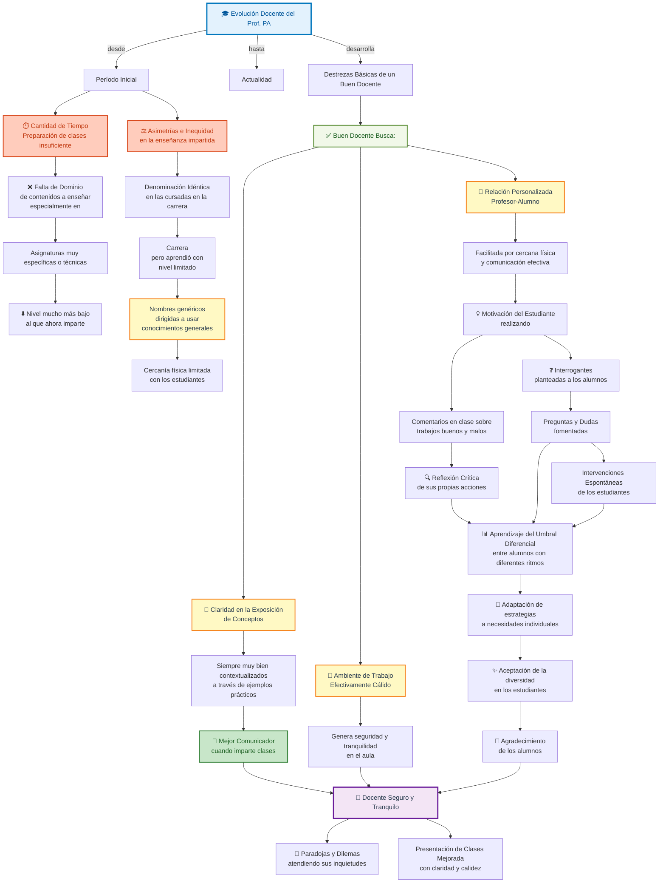

# Mapa Conceptual: Evolución Docente del Profesor PA

## Desarrollo Profesional y Mejora Continua

```mermaid
flowchart TD
    classDef inicio fill:#e8f4f8,stroke:#0277bd,stroke-width:2px,color:#01579b;
    classDef proceso fill:#fff9c4,stroke:#f57f17,stroke-width:2px,color:#2c3e50;
    classDef resultado fill:#c8e6c9,stroke:#2e7d32,stroke-width:2px,color:#1b5e20;
    classDef problema fill:#ffccbc,stroke:#d84315,stroke-width:2px,color:#bf360c;
    classDef solucion fill:#f3e5f5,stroke:#6a1b9a,stroke-width:2px,color:#2c3e50;

    Inicio["🎓 Evolución Docente del Prof. PA"]:::inicio
    
    Inicio -->|desde| Periodo1["Período Inicial"]
    Inicio -->|hasta| Periodo2["Actualidad"]
    Inicio -->|desarrolla| Destrezas["Destrezas Básicas de un Buen Docente"]
    
    %% Período Inicial - Desafíos
    Periodo1 --> Cantidad["⏱️ Cantidad de Tiempo<br/>Preparación de clases insuficiente"]:::problema
    Periodo1 --> Asimetrías["⚖️ Asimetrías e Inequidad<br/>en la enseñanza impartida"]:::problema
    
    Asimetrías --> Denominacion["Denominación Idéntica<br/>en las cursadas en la carrera"]
    Denominacion --> Carrera["Carrera<br/>pero aprendió con<br/>nivel limitado"]
    
    Cantidad --> Falta["❌ Falta de Dominio<br/>de contenidos a enseñar<br/>especialmente en"]
    Falta --> AsignaturasEsp["Asignaturas muy específicas o técnicas"]
    AsignaturasEsp --> NivelBajo["⬇️ Nivel mucho más bajo<br/>al que ahora imparte"]
    
    Carrera --> Nombres["Nombres genéricos<br/>dirigidas a usar<br/>conocimientos generales"]:::proceso
    Nombres --> CercanaFisica["Cercanía física limitada<br/>con los estudiantes"]
    
    %% Destrezas Básicas - Desarrollo
    Destrezas --> BuenDocente["✅ Buen Docente Busca:"]:::resultado
    
    BuenDocente --> Claridad["📝 Claridad en la Exposición<br/>de Conceptos"]:::proceso
    Claridad --> Contexto["Siempre muy bien contextualizados<br/>a través de ejemplos prácticos"]
    
    BuenDocente --> Relacion["🤝 Relación Personalizada<br/>Profesor-Alumno"]:::proceso
    Relacion --> Cercania["Facilitada por cercana física<br/>y comunicación efectiva"]
    
    BuenDocente --> AmbienteTrabajo["🌱 Ambiente de Trabajo<br/>Efectivamente Cálido"]:::proceso
    AmbienteTrabajo --> Seguridad["Genera seguridad y tranquilidad<br/>en el aula"]
    
    %% Mejoras Implementadas
    Contexto --> Comunicacion["📢 Mejor Comunicador<br/>cuando imparte clases"]:::resultado
    Cercania --> Motivacion["💡 Motivación del Estudiante<br/>realizando"]
    
    Motivacion --> Comentarios["Comentarios en clase sobre<br/>trabajos buenos y malos"]
    Comentarios --> Reflexion["🔍 Reflexión Crítica<br/>de sus propias acciones"]
    
    Motivacion --> Interrogantes["❓ Interrogantes<br/>planteadas a los alumnos"]
    Interrogantes --> Preguntas["Preguntas y Dudas<br/>fomentadas"]
    Preguntas --> Intervenciones["Intervenciones Espontáneas<br/>de los estudiantes"]
    
    Reflexion --> Aprendizaje["📊 Aprendizaje del Umbral Diferencial<br/>entre alumnos con diferentes ritmos"]
    Preguntas --> Aprendizaje
    Intervenciones --> Aprendizaje
    
    Aprendizaje --> Adaptacion["🎯 Adaptación de estrategias<br/>a necesidades individuales"]
    Adaptacion --> Aceptacion["✨ Aceptación de la diversidad<br/>en los estudiantes"]
    
    Aceptacion --> Agradecimiento["🙏 Agradecimiento<br/>de los alumnos"]
    
    %% Resultado Final
    Comunicacion --> ResultadoFinal["🌟 Docente Seguro y Tranquilo"]:::solucion
    Seguridad --> ResultadoFinal
    Agradecimiento --> ResultadoFinal
    
    ResultadoFinal --> Paradojas["🔄 Paradojas y Dilemas<br/>atendiendo sus inquietudes"]
    ResultadoFinal --> PresentacionClases["Presentación de Clases Mejorada<br/>con claridad y calidez"]
    
    style Inicio fill:#e3f2fd,stroke:#0277bd,stroke-width:3px
    style BuenDocente fill:#f1f8e9,stroke:#558b2f,stroke-width:2px
    style Comunicacion fill:#c8e6c9,stroke:#2e7d32,stroke-width:2px
    style ResultadoFinal fill:#f3e5f5,stroke:#6a1b9a,stroke-width:3px
```
